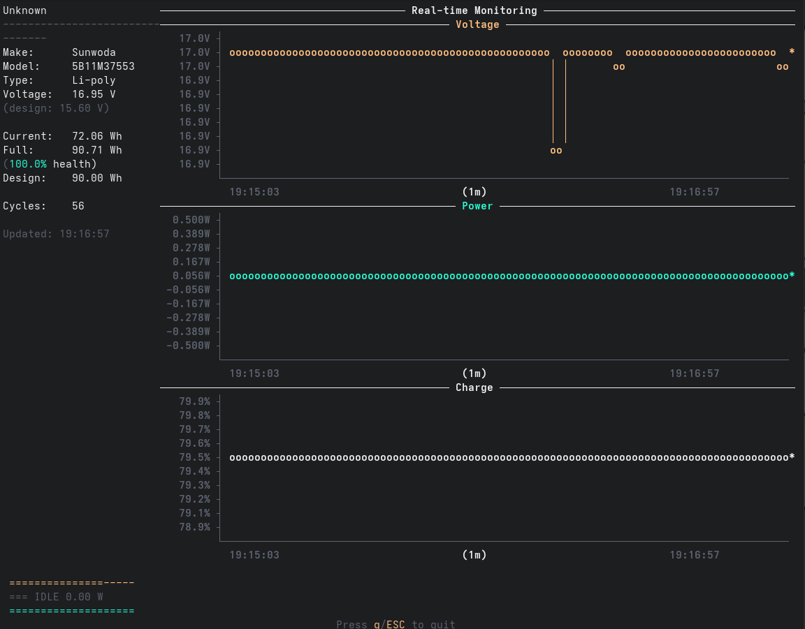

# go-battop

Interactive battery viewer in the terminal (Go version)


`battop` is an interactive viewer, similar to `top`, `htop` and other `*top` utilities, but for battery information. It provides a detailed, real-time view of your laptop's battery status, including charge levels, power consumption, and health metrics.



## Features

### Core Functionality
- 📊 **Real-time Monitoring**: Updates every second with live battery statistics
- 📈 **Time-Series Charts**: Interactive graphs for voltage, power, and charge percentage with auto-scaling Y-axis
- 🔋 **Multi-Battery Support**: Seamlessly switch between multiple batteries using Tab/Shift+Tab
- 🎨 **Beautiful TUI**: Color-coded interface with gradient progress bars and ASCII art charts

### Detailed Information Display
- **Battery Identification**: Make, model, serial number, and battery type
- **Voltage Monitoring**: Current voltage with design voltage reference
- **Capacity Tracking**: Current charge, full capacity, and design capacity in Wh
- **Health Metrics**: Battery health percentage (current full capacity vs design)
- **Cycle Count**: Number of complete charge/discharge cycles
- **Power Flow**: Real-time power consumption/charging rate
- **Time Estimates**: Remaining time to empty (discharging) or full (charging)

### Visual Indicators
- ⚡ **Status Icons**: Clear charging/discharging/idle state indicators
- 🌈 **Color Coding**: 
  - Green for good battery health (>80%)
  - Yellow for moderate health (50-80%)
  - Orange for time remaining warnings
  - Red for low battery or poor health
- 📊 **Progress Bars**: Visual representation of charge level and health
- 📈 **Live Charts**: Smooth Braille-character based line graphs

### User Experience
- ⌨️ **Vim-Style Navigation**: Use h/l keys for tab switching
- 🔧 **Flexible Units**: Toggle between human-readable (W/Wh) and raw (mW/mWh) units
- 💡 **Help Footer**: Always-visible keyboard shortcuts
- 🖥️ **Cross-Platform**: Works on Linux, macOS, and FreeBSD

## Installation

### From Source

```bash
# Clone the repository
git clone https://github.com/xsikor/go-battop.git
cd go-battop

# Build
make build

# Install to your PATH
make install
```

### Requirements

- Go 1.21 or higher
- Linux, macOS, or FreeBSD

## Usage

```bash
# Run with default settings
battop

# Run with custom update interval
battop -delay 2s

# Show raw values (mW/mWh instead of W/Wh)
battop -units raw

# Enable verbose logging
battop -verbose

# Show version
battop -version
```

### Keyboard Shortcuts

- `q` or `Esc` or `Ctrl+C`: Quit
- `Tab` or `→` or `l`: Next battery
- `Shift+Tab` or `←` or `h`: Previous battery

## Configuration Options

| Flag | Description | Default |
|------|-------------|---------|
| `-delay` | Update interval (e.g., 1s, 500ms) | 1s |
| `-units` | Display units (human: W/Wh, raw: mW/mWh) | human |
| `-verbose` | Enable verbose logging | false |
| `-version` | Show version and exit | false |

## Building from Source

```bash
# Standard build
make build

# Release build (optimized)
make release

# Build for all platforms
make build-all

# Run tests
make test

# Format code
make fmt
```

## Technical Details

### Architecture

The application follows an **event-driven architecture** with clear separation of concerns:

- **Channel-Based Communication**: Components communicate through Go channels for thread-safe operation
- **Event System**: Central event manager routes events (Exit, NextTab, PreviousTab, Tick) between components
- **Concurrent Design**: Separate goroutines handle UI rendering, battery polling, and input processing

### Key Components

1. **Battery Manager** (`internal/battery/`)
   - Thread-safe battery data management with mutex protection
   - Cross-platform battery information via `distatus/battery`
   - Maintains historical data for chart visualization
   - Platform-specific optimizations for Linux

2. **UI System** (`internal/ui/`)
   - Built on `rivo/tview` for terminal UI framework
   - Custom ASCII chart rendering engine with Braille characters
   - Auto-scaling charts with time-based X-axis
   - Responsive layout with split-panel design

3. **Application Core** (`internal/app/`)
   - Event orchestration and routing
   - Configuration management
   - Application lifecycle control

### Design Patterns

- **Interface-Based Design**: Prevents circular dependencies between packages
- **Factory Pattern**: Used for repository initialization
- **Observer Pattern**: Event system for loose coupling
- **Singleton**: Battery manager ensures single source of truth

### Performance Considerations

- **Efficient Polling**: Configurable update intervals to balance freshness vs CPU usage
- **Minimal Dependencies**: Only essential libraries for small binary size
- **Memory Management**: Fixed-size history buffers for charts prevent memory growth

## Development

This is a Go rewrite of the original Rust battop project. The goal is to maintain feature parity while leveraging Go's simplicity and the tview library for terminal UI.

### Project Structure

```
├── cmd/battop/          # Application entry point
├── internal/
│   ├── app/            # Application core and orchestration
│   ├── battery/        # Battery information management
│   ├── errors/         # Custom error types
│   └── ui/             # Terminal UI components
├── plan/               # Development plans and documentation
└── old/                # Original Rust implementation (reference)
```

### Development Tools

- **AI-Assisted Development**: The project includes a `CLAUDE.md` file with guidelines for AI pair programming
- **Hot Reload**: Use `make dev` with [air](https://github.com/cosmtrek/air) for automatic recompilation
- **Debugging**: 
  - Logs are written to `/tmp/go-battop.log` (or OS temp directory)
  - Use `-verbose` flag for detailed debug output
  - Structured logging with `slog` for better debugging experience

### Dependencies

- [tview](https://github.com/rivo/tview) - Terminal UI framework
- [distatus/battery](https://github.com/distatus/battery) - Cross-platform battery information
- [tcell](https://github.com/gdamore/tcell) - Terminal handling

### Contributing

1. Fork the repository
2. Create your feature branch (`git checkout -b feature/amazing-feature`)
3. Run `make fmt` and `make lint` before committing
4. Commit your changes (`git commit -m 'Add some amazing feature'`)
5. Push to the branch (`git push origin feature/amazing-feature`)
6. Open a Pull Request

## License

Licensed under either of:

- Apache License, Version 2.0 ([LICENSE-APACHE](LICENSE-APACHE))
- MIT license ([LICENSE-MIT](LICENSE-MIT))

at your option.

## Acknowledgments

This is a Go port of the original [rust-battop](https://github.com/svartalf/rust-battop) project by svartalf.